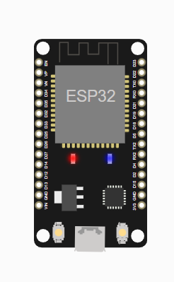

# Encender LEd
------------------------------------------

## Práctica: Usar el Led de  ESP32

<video width="320" height="240" controls>
  <source src="video.mp4" type="video/mp4">
</video>

## Material consultado
[código de Conexión](https://raw.githubusercontent.com/ComputadorasySensores/Capitulo45/refs/heads/main/main.py)
[firebase authentication](https://www.telerik.com/blogs/firebase-authentication-using-custom-token)
[esp32 and firebase](https://medium.com/firebase-developers/getting-started-with-esp32-and-firebase-1e7f19f63401)