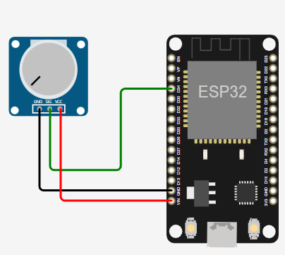

# Potenciómetro enviar información
------------------------------------------

## Práctica: Guardar datos del potenciómetro
Se envían datos a un servidor en la nube.  
Se accede a ese servidor y se muestran los datos en un gráfico

<video width="320" height="240" controls>
  <source src="video.mp4" type="video/mp4">
</video>